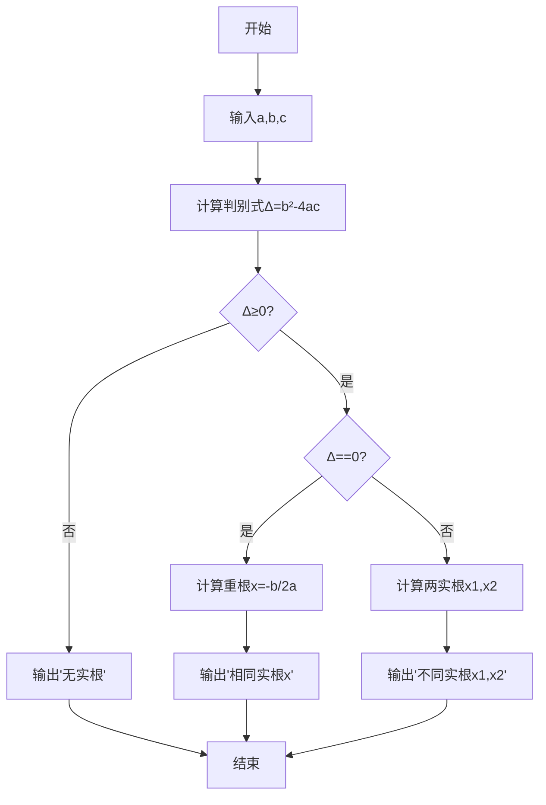

```mermaid

graph TD
    A[开始] --> B[输入a,b,c]
    B --> C[计算判别式Δ=b²-4ac]
    C --> D{Δ≥0?}
    D -->|否| E[输出'无实根'] --> F[结束]
    D -->|是| G{Δ==0?}
    G -->|是| H[计算重根x=-b/2a] --> I[输出'相同实根x'] --> F
    G -->|否| J[计算两实根x1,x2] --> K[输出'不同实根x1,x2'] --> F
```

