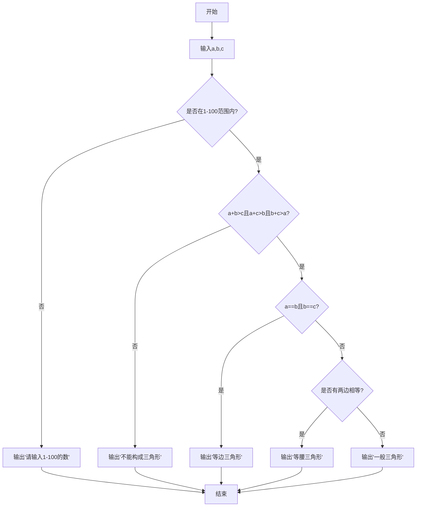

```mermaid
graph TD
    A[开始] --> B[输入a,b,c]
    B --> C{是否在1-100范围内?}
    C -->|否| D[输出'请输入1-100的数'] --> E[结束]
    C -->|是| F{a+b>c且a+c>b且b+c>a?}
    F -->|否| G[输出'不能构成三角形'] --> E
    F -->|是| H{a==b且b==c?}
    H -->|是| I[输出'等边三角形'] --> E
    H -->|否| J{是否有两边相等?}
    J -->|是| K[输出'等腰三角形'] --> E
    J -->|否| L[输出'一般三角形'] --> E
```
